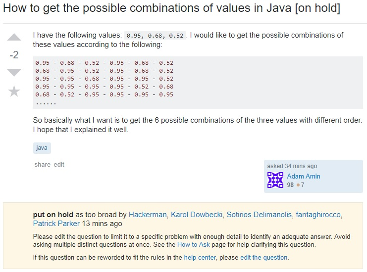

> "If you give a hungry man a fish, you feed him for a day, but if you teach him how to fish, you feed him for a lifetime."

The quest for knowledge always begins with a question, and humanity's thirst for knowledge is unquenchable. Thus, to be given knowledge can only offer momentary satisfaction; to be taught to find knowledge can offer potentially limitless fulfillment. In order to achieve the greatest fulfillment in the neverending search for knowledge, one must ask the greatest questions.

As those who enter the world of computing quickly find out, a major deciding factor in the speed and efficiency at which one learns and works is the ability to search and find solutions to the countless obstacles that arise in software development. However, one can only search so many manuals, guides, forums, and websites before it becomes apparent that perhaps the more efficient route would be to ask someone who knows the answer. This is where the art of asking a question comes into play: the easier and more attractive a question is to answer, the easier it will be for the asker to accomplish their goals.

So how is a good question crafted? In order to gain insight into the characteristics of good and bad questions, one of each question from Stack Overflow will be reviewed according to the guidelines in Eric Raymond's [How To Ask Questions The Smart Way](http://www.catb.org/esr/faqs/smart-questions.html).

Starting with the good, here is [a question posted by GManNickG](https://stackoverflow.com/questions/11227809/why-is-it-faster-to-process-a-sorted-array-than-an-unsorted-array). It has many characteristics that make it a great question. First of all, before Nick asked, he attempted to find an answer by experimenting. He took the time to try and solve the problem on his own and established that he is more than just a lazy drain of resources—he is a person willing to learn and do the work required to finding the answers he seeks. Second, he chose the right venue to ask (Stack Overflow). Due to the large amount of specialists working with similar topics in software development, Nick has maximized his exposure to the people who are most willing and able to provide an answer to his question. Also by Stack Overflow's inherent format, he made his question accessible and easy for others to reply. In addition to these, he also had a specific subject header, used clear and correct language, was precise and informative about the problem, and described the goal as opposed to the step.

All of these characteristics contributed to creating an excellent question, and it was rewarded with numerous high-quality answers and upvotes. Such answers are dense with information and require a considerable amount of time to make. 

For contrast, here is an example of a bad question:

Here a picture is provided because questions which are downvoted enough usually indicate a question that shouldn't be posted on Stack Overflow. Posters are given some amount of time to edit their questions to better fit the Stack Overflow guidelines before being removed.

The bad characteristics of this question highlight the the good in the previous question. First of all, the warning provided by Stack Overflow moderators indicates that the question is not precise about the problem nor explicit about the question.  Secondly, the format of this question seems like it would do better if asked in a more casual setting—it seems as if the asker doesn't really know what to ask and needs to learn about keywords (such as, perhaps, combination or permutation) and would do better to ask for a bit of advice in a chat with a friend, associate, or other person who's willing to help. It follows then that this question shows a lack of research beforehand (whether intentional or not) and more time should be spent researching the surrounding topics of the problem. Raymond's guidelines mention that such questions are a waste of time for people looking for challenging or important questions to answer and become ruthlessly filtered as a result.

It can be seen here that a lot of emphasis is placed on the volunteers who answer questions. This makes sense, as these people give their time and energy to the large, endless mass that is the community. In order to sustain this, many must give collectively so that the community may prosper. The individual never truly knowing their impact—only some vague sense that they have helped the world become a tiny bit better. As people in all walks of life continue their quests for knowledge, they will slowly go from askers to answerers. With this in mind, perhaps it is best to view Raymond's guidelines in a much broader sense:
>  "Do unto others as you would have them do unto you."
