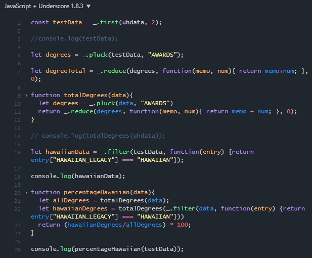

When I first heard of JavaScript, I didn't give it much thought. I was already studying C/C++, Java, and Python at the time, with my eye on trying out C# next. I liked dealing more with systems and back-end work, where it was important to analyze a situation and come up with a proper architecture. A quick Google told me it was used in HTML. I hated working web—HTML and CSS were beyond me and I just disliked looking at the format and syntax; it was ugly to me. I didn't care for spending hours perfecting how a website looked when I could instead spend hours trying to get logic and control on some I/O to work. After reading about JavaScript, I quickly dismissed it and expected never to return until I had no other option but to do web-work myself.

That was then. Now, I've been exposed to it one of my courses and my perception has changed. Doing work in Python after long stints in C made me appreciate the simplicity and ease of programming in higher-level languages. And after working in C++ and Java, Python was a breath of fresh air in terms of weakly typed objects and just sheer ease of accomplishing simple tasks. These traits came to mind when I started tackling my first few problems in JavaScript—weakly typed variables and a simple syntax made it easy to take my first steps. Okay, so maybe JavaScript isn't too bad.

Then I found out a few more nice things about JavaScript. One quick mention is JSFiddle. I love things that work in the cloud because I am a heavy user of cloud technology and I'm very mobile when I work. I love to share my code and read others' code. JSFiddle was so simple and easy to use that I couldn't help but instantly love it. Aside from this tool, I also found some other convenient things about the language itself—some simple, and one pretty big one. First off, after coming from C++, I definitely appreciate the option of iterators. JavaScript brings that to the table in the form of for...of loops. I can't wait to try it out more to see what it can really do. Second, block-scope interests me greatly. I found out about it thanks to an article on let and const and it makes me eager to try and see how I can make use of this new organizational tool. And finally, prototype inheritance. I just finished a relatively simple project in C++ where my aim was to make use of inheritance and abstract classes; by far the most complicated part was carefully analyzing the system, the purpose of the program, and possible use-cases to come up with a future-proof class architecture. After watching a video comparing JavaScript to other languages, it mentioned how prototype inheritance is able to evolve during runtime and that really caught my attention. To be able to create a class hierarchy that can change and evolve for its user's needs takes a lot of the mysticism out of trying to predict the future and lets me just start coding with a simple set of classes in mind to which I can later add more functionality. It's very convenient and allows you to just get working without being too worried about the future of your code.

JavaScript was so easy to get into and has some features that I can now appreciate and be curious about. My impressions of JavaScript are much better now—in fact, I can't wait to find a great project to use it in. Perhaps when I first heard about it, the time just wasn't right for me. It's great to look back and see how an opinion can change so drastically—I was sure that I'd want nothing to do with web and JavaScript, yet here I am now wondering what possibilities I might have if I wanted to put some code on a website. It's a great lesson to give things a chance before you judge, and never be afraid to revisit your opinion when your perspective has widened.
