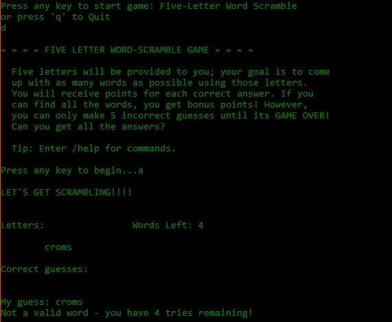

For my EE 205 final project, our team created a simple game engine from scratch and included a five-letter word scramble game. I wrote a large percentage of the code and implemented an interface to make it easy to add new games to the engine. All you need to do is inherit from the GameMode and GameState abstract classes and add the game to the main menu. The project was used to practice and exemplify object oriented programming and become familiar with its systems, and can be used by anybody to further practice OOP in C/C++ by adding new games themselves.

Source: <a href="https://github.com/gbarcelo/Simple-Game-Engine"><i class="large github icon"></i>gbarcelo/Simple-Game-Engine</a>
