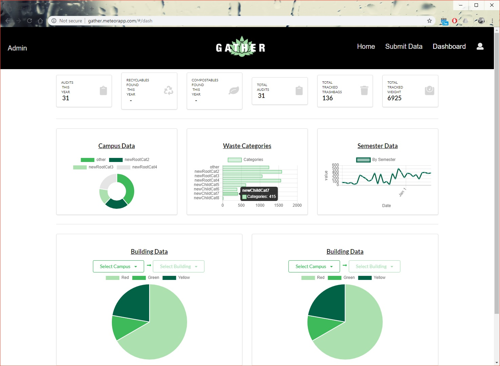

As part of my final project for ICS 314 - Software Engineering I course, I participated in a hack-a-thon with the intent of creating a web app using the Meteor framework with React and MongoDB. Together with a team of fellow classmates, we chose to tackle the 'Trash Audit' Challenge and create an app backed by a centralized cloud database that allows users to view and contribute trash audit data.

Like us, you may have never heard of a trash audit before. Basically, bags of trash are saved over a predetermined period of time. Then, on the day of the audit, the saved trash bags are opened and sorted into various categories for weighing and sometimes counting. The collected data is then put into an Excel sheet and analyzed by the University of Hawai'i at Manoa's Department of Sustainability (DoS). It's a messy job—it can't be helped—but the data collection and storage could be improved. With an app and database connected to the cloud, the data can be analyzed, visualized, and grown from anywhere by anybody with permission from the DoS. This removes the bottleneck at the administrative level and allows the DoS to scale up their endeavors effortlessly.

While easy to describe, the project was difficult to implement. This is because simple, commonplace words like apps and databases are truly powerful systems that hold a lot of complexity within them—they must be implemented correctly and with care. In addition, and perhaps the greatest hurdle of all, our entire team used this project to learn the Meteor, React, and MongoDB frameworks and libraries for the first time. Thus, a considerable amount of time was spent on basics and fundamentals—no doubt a price we would not be paying if we were to start a new project with similar functionalities.
