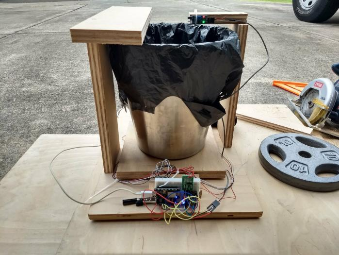

As part of my final project for ICS 314 - Software Engineering I course, I participated in a hack-a-thon with the intent of creating a web app using the Meteor framework with React and MongoDB. Together with a team of six other fellow classmates, we chose to tackle the 'Trash Audit' Challenge and create an app backed by a centralized cloud database that allows users to view and contribute trash audit data.

Like us, you may have never heard of a trash audit before. Basically, bags of trash are saved over a predetermined period of time. Then, on the day of the audit, the saved trash bags are opened and sorted into various categories for weighing and sometimes counting. The collected data is then put into an Excel sheet and analyzed by the University of Hawai'i at Manoa's Department of Sustainability (DoS). It's a messy job—it can't be helped—but the data collection and storage could be improved. With an app and database connected to the cloud, the data can be analyzed, visualized, and grown from anywhere by anybody with permission from the DoS. This removes the bottleneck at the administrative level and allows the DoS to scale up their endeavors effortlessly.

While easy to describe, the project was difficult to implement. This is because simple, commonplace words like apps and databases are truly powerful systems that hold a lot of complexity within them—they must be implemented correctly and with care. In addition, and perhaps the greatest hurdle of all, our entire team used this project to learn the Meteor, React, and MongoDB frameworks and libraries for the first time. Thus, a considerable amount of time was spent on basics and fundamentals—no doubt a price we would not be paying if we were to start a new project with similar functionalities.

During the hack-a-thon, my main roles were team leader and hardware engineer. On the team-lead side, I made extensive use of Git and GitHub to manage project code and deadlines, making sure all team members were on the same page with regards to version control protocol and project goals.

For our repository protocol, a system of branches was maintained consisting of master, dev, and feature branches. Team members were only allowed to work on feature branches, and would create a pull request into the dev branch when they were done with a specific feature. The dev branch was only pulled into master for important deadlines or milestones, allowing the master branch to represent the cleanest version of our codebase up to that time.

As part of our project management guidelines, we used GitHub's system for Issues, Milestones, and Projects to organize each team member's tasks and goals in a modular manner. Here, it was my job to make sure everbody kept their status up-to-date so that it would be easier for everybody to know what was going on. Also, it was my job to make sure the work would be delegated in a way that minimized team members waiting for other team members to complete a feature. After these priorities, it was my job to troubleshoot any hang-ups or delays that team members were experiencing, and shift directions when obstacles did not offer enough reward for the time spent. 

On the hardware side, our team chose to create a smartbin that counted items put into it, weighed them, and sent the data to our web app as a JSON string. Because I was the only one on the team with hardware experience, this part of the project was my responsibility from start to finish. The smartbin was implemented using proximity and load cell sensors connected to a NodeMCU WiFi Development Board that’s programmed to push data to our database using the MQTT protocol. The housing for the smartbin, its sensors, and the NodeMCU were made of wood. The NodeMCU allows you to upload code in the same way as Arduino, and so premade Arduino libraries were used for converting sensor data to weight in pounds (lb.), converting data into a JSON string, and connecting to the internet (using the built-in ESP8266 WiFi module) to send to our app. I was fortunate that all components were working on arrival and was able to complete the manufacturing, assembly, programming, and calibration of this device in one day.

In the end, despite the stress and time spent, I am extremely glad I went through this experience. I learned and practiced so many things on this project, and had a lot of fun doing it. I learned so much about Meteor and frameworks in general that I had never thought about before. Exploring Meteor for this project allowed me to realize that there was a larger picture, and all frameworks focus on that larger picture so that I just focus on the rules of the framework—which, in a well-designed framework, are easier to manage than the larger picture. I got to practice database and data structure concepts, especially linking data together, reformatting and restructuring it, and traversing it in different ways depending on a desired output (such as different types of graphs). I got to use proximity sensors and load-cell sensors for the first time in a practical application, and got to explore a WiFi-enabled Arduino-like development board. I learned the nuances of project management and got to actually practice it with capable, motivated individuals.

Beyond all these lessons, though, I really had an absolute blast. I gained immense enjoyment and satisfaction from having an opportunity to apply skills from many different classes in one practical project, and to do so with a great team of intelligent and driven people.
