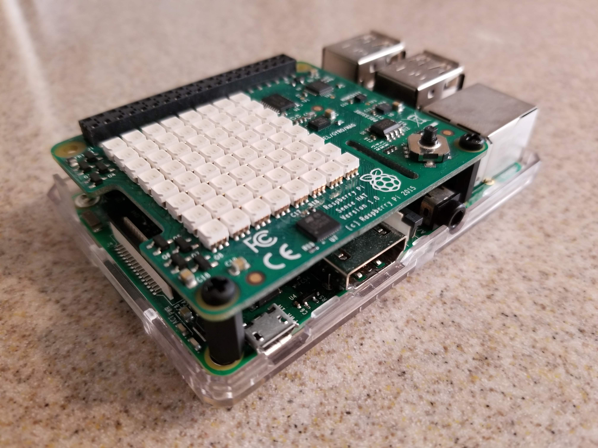

For my group's final project in EE 491E, we decided to implement an IoT solution that uses Bluetooth "beacons" to control office lights to turn on only when a beacon is close to the work area. The dream is to create a scalable model for buildings that will allow electricty to be conserved when rooms are not in use. By having a small beacon on keychains or badges of employees, the proximity system will know what part of a building is being used and adjust the lights accordingly. Data on office and light usage can help administrative personnel better understand their energy usage, office layout, and other data that could potentially provide evidence for restructuring of workspaces or office procedures for further efficiency improvements. We are simulating this system using a Raspberry Pi, Sense HAT, and Estimote Beacon.

The Raspberry Pi will act as the detector, sensing any beacons and their distance from the Pi using Bluetooth. The Sense HAT is a Raspberry Pi add-on that gives access to a multitude of sensors and matrix of LEDs. For this project, we will only be using the LED matrix to represent the office lights, which will be turned on and off based on the proximity of a user holding a beacon.

Beacons are devices that emit a signal (usually through Bluetooth) that can be programmed to broadcast various data to any nearby, receptive devices. For example, you can send a clickable URL as a push notification to Android devices that allow the permission; or, you can send signal strength and a unique ID to calculate distances between beacons. Our project will be concerned with the latter.

In order to tie this all together, we will be using Node-RED in combination with the IBM Cloud IoT platform. Node-RED is a visual-programming tool that makes it easy for JavaScript programmers of any level to control the flow of data and respond to it as it flows back and forth between various hardware devices and the cloud. IBM Cloud is a platform that provides platform as a service (PaaS) and infrastructures as a service (IaaS). We will be using Node-RED and IBM Cloud to facilitate the connection, communication, and persistence of data between our various devices and the logic that guides them.

Currently, we are in the early phases of the project. We have just succeeded in getting a signal between a beacon and Raspberry Pi and calculating the distance between them. In the coming weeks we will be building basic light-control logic and hope to add:
<ul>
<li>an inuitive UI for users</li>
<li>profiles for individual users allowing them to personalize light level and color</li>
<li>visualization tools to allow administrators to more easily draw conclusions from light usage</li>
</ul>
Unfortunately, due to how code is saved in Node-RED and across devices, it cannot be easily exported for view in a GitHub repository. Feel free to contact me for any questions or examples of code.
